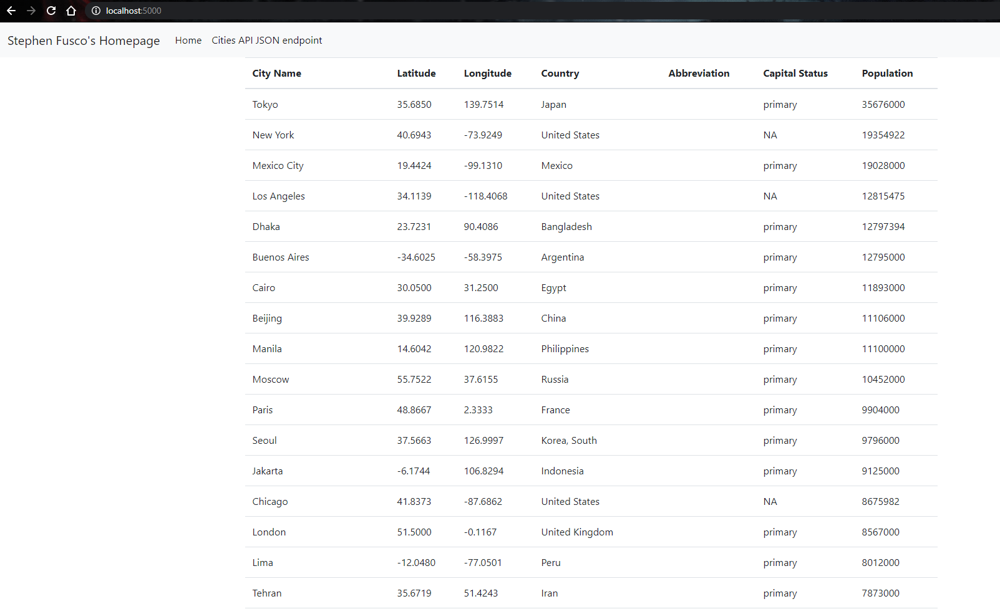

# Project Description
This project is a homework assignment to teach how to get Pycharm setup with Docker, Flask, MySQL, and Postman

# SQL Data Screenshot

# Postman Data Query

# HTML Query Screenshot

